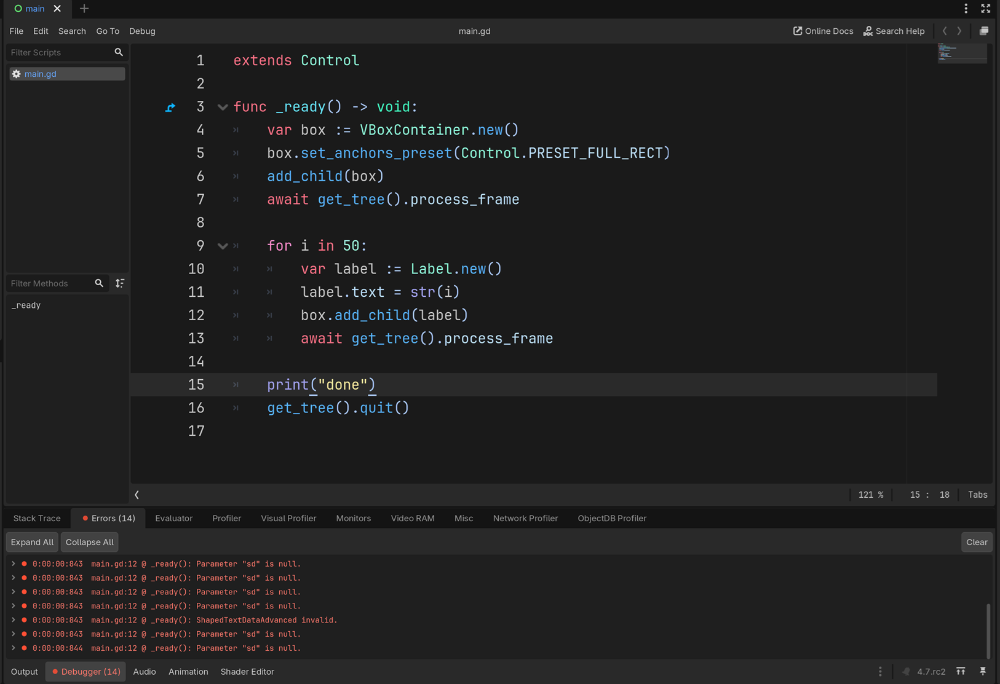

# godot-mrp-120275

Minimal repro for [godotengine/godot#120275](https://github.com/godotengine/godot/issues/120275).

Run on **Godot 4.7-rc2**. Adding a bunch of `Label` to a `Container` spams the console:

```
E 0:00:00:842   main.gd:12 @ _ready(): Condition "p_start < 0 || p_length < 0" is true. Returning: RID()
  <C++ Source>  modules/text_server_adv/text_server_adv.cpp:5543 @ _shaped_text_substr()
  <Stack Trace> main.gd:12 @ _ready()
```
```
E 0:00:00:843   main.gd:12 @ _ready(): Parameter "sd" is null.
  <C++ Source>  modules/text_server_adv/text_server_adv.cpp:7803 @ _shaped_text_get_ascent()
  <Stack Trace> main.gd:12 @ _ready()
```
```
E 0:00:00:843   main.gd:12 @ _ready(): ShapedTextDataAdvanced invalid.
  <C++ Error>   Parameter "sd" is null.
  <C++ Source>  modules/text_server_adv/text_server_adv.cpp:6199 @ _shaped_text_overrun_trim_to_width()
  <Stack Trace> main.gd:12 @ _ready()
```

Errors do not spam with with Godot 4.7-rc1.

### Other notes
- The errors only appear when the default font uses `MSDF`. Turn `MSDF` off and they stop.
- The error appears to be intermittent. Because this repo spams labels you can see the number of errors varies with each run.

<br>



